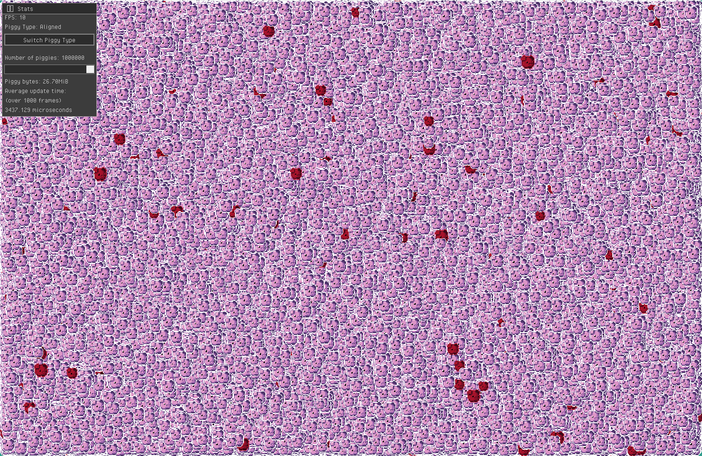

## Bouncing Piggies

Bouncing Piggies is an application that does nothing but show a bunch of piggies bouncing around the screen.

This project was inspired by a discussion around how packing structs would affect performance.
To stress test it, this app spawns an ungodly number of entities described as structs that don't align neatly with 64-bit architecture.
It then renders them as they bounce along the screen.
It can manage the data for the pigs as either aligned (aka "unpacked") structs or packed structs.

You can adjust the number of pigs and toggle between packed & unpacked structs and see how it affects your framerate.

### Results

For the curious, the packed structs used less memory and had _marginally_ better performance on my machine.
The difference was pretty small, however: several hundred microseconds per frame while updating 1,000,000 entities.

Note that this does not guarantee that packing structs will improve all programs in all situations on all machines.
It only proves that it's a _possible_ route for optimization.

Really, if you're using this many entities, you're better off using other strategies,
such as [SoA](https://en.wikipedia.org/wiki/AoS_and_SoA#Structure_of_arrays)
or [ECS](https://en.wikipedia.org/wiki/Entity_component_system)
to manage them.

### How to run

This app is written in Odin, so you'll need the Odin compiler set up to compile the app.
You can read all about it and how to set it up on [the Odin website](https://odin-lang.org/).

Once you have that set up, you just need to build it locally and run using `odin run src`.
Since this is intended to stress test performance, you might want to add the `-o:speed` flag, so `odin run src -o:speed` would be the full command.

### Where'd that cute little piggy sprite come from?

I just searched for pig sprites on Itch.io and found a free one.
Here's [the creator's page on Itch](https://caz-creates-games.itch.io/piggy)

